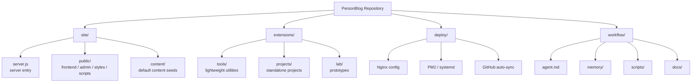
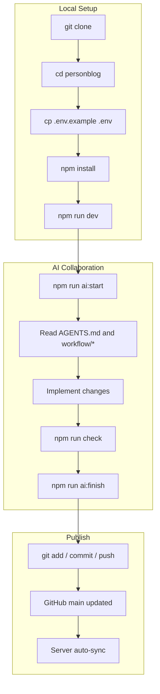

# PersonBlog

<div align="center">

### A personal site repository for identity, writing, tools, experiments, and future projects

[中文](./README.zh-CN.md) | [English](./README.en.md)

</div>

---

## Quick Answer

### Do I need to run anything inside `deploy/` for local development?

No.

`deploy/` is only for server deployment and production sync.  
For local development, this is usually enough:

```bash
git clone <your-repo-url>
cd personblog
cp .env.example .env
npm install
npm run dev
```

Default URLs:

- Frontend: `http://localhost:3000`
- Admin: `http://localhost:3000/admin-login`

### What do `site/server.js`, `site/public/`, and `site/content/` do?

- `site/server.js`
  Server entry. Starts the app, handles APIs, admin auth, and content loading/saving.
- `site/public/`
  Web layer. Frontend pages, admin pages, styles, and frontend scripts.
- `site/content/`
  Default content seeds. Production runtime content is stored in `storage/`, not here.

---

## Top-Level Structure

```text
personblog/
├─ site/         current main site
├─ extensions/   future tools / projects / experiments
├─ deploy/       server deployment and sync
├─ workflow/     AI collaboration workflow
└─ storage/      runtime data (generated in production, not tracked)
```

## Structure Graph



---

## AI Workflow

### Start Task

```bash
npm run ai:start -- "task summary"
```

### Print Context

```bash
npm run ai:context
```

### Finish Task

```bash
npm run ai:finish -- "completed summary"
```

## Workflow Graph



---

## Deployment

See:

- [DEPLOY.md](./DEPLOY.md)
- [deploy/](./deploy)

---

## License

[MIT](./LICENSE)
