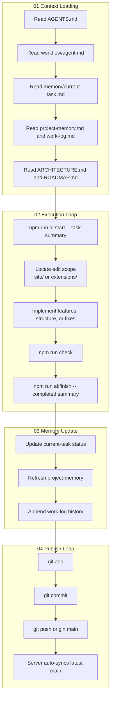

# PersonBlog

<div align="center">

### A repository that combines a personal site, blog, AI workflow, and future extension entry points in one place

[Default README](./README.md) | [中文](./README.zh-CN.md)

</div>

---

## Positioning

This repository is not just a single-page template. It is meant to be a long-lived foundation for a growing personal platform.

It carries four jobs at once:

- personal homepage and blog
- a unified entry for future tools, experiments, and standalone projects
- a lightweight editable admin layer
- a fixed workflow for AI-assisted development

In practice, it behaves more like a personal digital hub than a one-off static site.

---

## One-Line Start

Local run:

```bash
git clone <your-repo-url> personblog && cd personblog && node -e "const fs=require('fs');if(!fs.existsSync('.env'))fs.copyFileSync('.env.example','.env')" && npm install && npm run dev
```

Server deployment:

```bash
curl -fsSL https://raw.githubusercontent.com/1218594966/blog/main/deploy/setup-ubuntu.sh | sudo DOMAIN=your-domain.com WWW_DOMAIN=www.your-domain.com CERTBOT_EMAIL=you@example.com ADMIN_USERNAME=admin ADMIN_PASSWORD=change-this-password SESSION_SECRET=replace-with-a-long-random-string bash
```

Only replace the values in that single line:

- `your-domain.com`
- `www.your-domain.com`
- `you@example.com`
- `ADMIN_USERNAME`
- `ADMIN_PASSWORD`
- `SESSION_SECRET`

If the server command is used, the deployment will already include:

- PM2 process management
- auto-restart after server reboot
- Nginx reverse proxy
- GitHub auto-sync updates
- automatic reload of the latest process definition
- optional HTTPS certificate issuance

---

## Repository Map

```text
personblog/
├─ site/          main site code
├─ extensions/    future tools, projects, and experiments
├─ workflow/      AI collaboration workflow
├─ deploy/        server automation files
├─ storage/       runtime data (generated in production, not tracked)
├─ README.md
├─ README.zh-CN.md
├─ README.en.md
├─ AGENTS.md
├─ package.json
└─ ecosystem.config.cjs
```

## Architecture Graph

```mermaid
flowchart TD
    R["PersonBlog Repository"] --> S["site/"]
    R --> E["extensions/"]
    R --> W["workflow/"]
    R --> D["deploy/"]
    R --> T["storage/"]

    S --> S1["server.js<br/>server entry"]
    S --> S2["public/<br/>frontend, admin, styles, scripts"]
    S --> S3["content/<br/>default content seeds"]

    E --> E1["tools/<br/>lightweight utilities"]
    E --> E2["projects/<br/>standalone projects"]
    E --> E3["lab/<br/>experiments and prototypes"]

    W --> W1["agent.md<br/>AI execution rules"]
    W --> W2["memory/<br/>project memory and history"]
    W --> W3["scripts/<br/>start, print, finish task"]
    W --> W4["docs/<br/>architecture and roadmap"]

    D --> D1["setup-ubuntu.sh<br/>one-line deployment"]
    D --> D2["sync/update scripts<br/>pull and restart"]
    D --> D3["service/timer/nginx<br/>server templates"]

    T --> T1["site-content.json"]
    T --> T2["messages.json"]
    T --> T3["ai-config*.json"]
```



---

## What Each Area Does

| Path | Role |
| --- | --- |
| `site/server.js` | Main server entry. Starts Express, handles APIs, admin auth, content persistence, and AI proxy calls. |
| `site/public/` | Frontend layer. Home page, admin page, styles, frontend scripts, and static assets live here. |
| `site/content/` | Default content seeds used as the initial site payload on a fresh setup. |
| `extensions/tools/` | Future lightweight tools such as prompt utilities, text helpers, or indexes. |
| `extensions/projects/` | Future standalone project entries. |
| `extensions/lab/` | Future prototypes, drafts, and experiments. |
| `workflow/` | Fixed AI context, memory files, scripts, and documentation. |
| `deploy/` | Server automation for one-line deployment, GitHub sync, and process/web-server setup. |
| `storage/` | Runtime data directory. Live content, messages, and private AI config are stored here outside Git. |

---

## How The Site Is Built

The site uses a lightweight backend plus static frontend pages:

- Node.js + Express provide the server and APIs
- `site/public/` serves the UI directly
- `site/content/` provides default content seeds
- `storage/` holds runtime content so `git pull` never overwrites live data

This keeps the project easy to understand while still leaving room for future growth inside `extensions/`.

---

## AI Workflow

The repository includes a fixed AI workflow so task context can live in files instead of being trapped in chat history.

### Read Order

1. `AGENTS.md`
2. `workflow/agent.md`
3. `workflow/memory/current-task.md`
4. `workflow/memory/project-memory.md`
5. `workflow/memory/work-log.md`
6. `workflow/docs/ARCHITECTURE.md`
7. `workflow/docs/ROADMAP.md`

### Core Commands

```bash
npm run ai:start -- "task summary"
npm run ai:context
npm run ai:finish -- "completed summary"
```

### Workflow Graph



---

## Local Run

```bash
git clone <your-repo-url> personblog && cd personblog && node -e "const fs=require('fs');if(!fs.existsSync('.env'))fs.copyFileSync('.env.example','.env')" && npm install && npm run dev
```

Default URLs:

- Frontend: `http://localhost:3000`
- Admin: `http://localhost:3000/admin-login`

---

## Runtime Data

Runtime data is written to `storage/`, not back into the repository:

- `storage/site-content.json`
- `storage/messages.json`
- `storage/ai-config.json`
- `storage/ai-config.private.json`

This keeps Git clean, protects private keys, and prevents live content from being overwritten by code updates.

---

## License

[MIT](./LICENSE)
