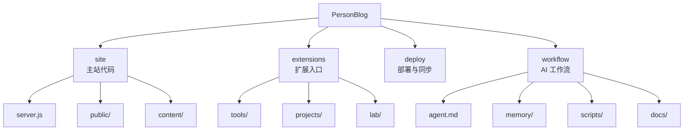

# PersonBlog

> A personal site hub for identity, writing, experiments, tools, and future projects.

一个可直接部署的个人网站仓库。  
它不是单纯的首页模板，而是一套逐步扩展的个人站点系统：

- `site/` 承载当前主站
- `extensions/` 承载未来工具、项目、实验页面
- `deploy/` 承载服务器部署与同步
- `workflow/` 承载 AI 协作上下文与项目记忆

---

## Overview

当前仓库已包含：

- 个人主页与品牌展示
- 后台登录与内容编辑
- 留言收集
- OpenAI 兼容模型接入的 AI 对话区
- 工具中心 / 项目中心 / 实验区入口
- GitHub 自动同步到服务器
- 面向 AI 开发协作的工作流与记忆系统

---

## After Clone

别人拉取这个项目后，通常只需要按下面的流程操作。

### 1. 本地运行

```bash
git clone <your-repo-url>
cd personblog
cp .env.example .env
npm install
npm run dev
```

默认访问：

- 前台：`http://localhost:3000`
- 后台：`http://localhost:3000/admin-login`

### 2. 如果只是想看结构

优先看这几个位置：

- [README.md](./README.md)
- [DEPLOY.md](./DEPLOY.md)
- [workflow/agent.md](./workflow/agent.md)
- [workflow/docs/ARCHITECTURE.md](./workflow/docs/ARCHITECTURE.md)

### 3. 如果想继续开发

先运行：

```bash
npm run ai:start -- "任务摘要"
npm run ai:context
```

然后按 `AGENTS.md` 指定的顺序读取上下文再开始修改。

### 4. 如果要部署到服务器

看这里：

- [DEPLOY.md](./DEPLOY.md)
- [deploy/](./deploy)

---

## Top-Level Structure

### `site/`

主站代码目录。

- `site/server.js`：网站服务端入口
- `site/public/`：前台页面、后台页面、样式、前端脚本
- `site/content/`：默认内容模板

### `extensions/`

未来扩展目录。

- `extensions/tools/`：轻量工具
- `extensions/projects/`：完整项目
- `extensions/lab/`：实验和原型

### `deploy/`

部署与服务器自动同步目录。

- Nginx 配置模板
- GitHub 自动同步脚本
- systemd service / timer

### `workflow/`

AI 协作工作流目录。

- `workflow/agent.md`：AI 操作上下文
- `workflow/memory/`：当前任务、项目记忆、工作日志
- `workflow/scripts/`：开始任务 / 输出上下文 / 结束任务
- `workflow/docs/`：架构、路线图、AI 工作流说明

---

## Structure Graph



---

## Runtime Data

运行时数据不会写回仓库，而是写入 `storage/`：

- `storage/site-content.json`
- `storage/messages.json`
- `storage/ai-config.json`
- `storage/ai-config.private.json`

这样做的目的：

- GitHub 仓库保持干净
- 服务器更新代码时不覆盖线上内容
- AI Key 不进入版本库

---

## AI Workflow

这个仓库内置了一套可持续使用的 AI 协作流程。

### 核心命令

开始任务：

```bash
npm run ai:start -- "任务摘要"
```

输出上下文：

```bash
npm run ai:context
```

结束任务并写入记忆：

```bash
npm run ai:finish -- "完成摘要"
```

### 读取顺序

1. [AGENTS.md](./AGENTS.md)
2. [workflow/agent.md](./workflow/agent.md)
3. [workflow/memory/current-task.md](./workflow/memory/current-task.md)
4. [workflow/memory/project-memory.md](./workflow/memory/project-memory.md)
5. [workflow/memory/work-log.md](./workflow/memory/work-log.md)
6. [workflow/docs/ARCHITECTURE.md](./workflow/docs/ARCHITECTURE.md)
7. [workflow/docs/ROADMAP.md](./workflow/docs/ROADMAP.md)

### Workflow Graph

```mermaid
flowchart LR
    A["git clone"] --> B["npm install"]
    B --> C["cp .env.example .env"]
    C --> D["npm run ai:start"]
    D --> E["npm run ai:context"]
    E --> F["实现与修改"]
    F --> G["npm run check"]
    G --> H["npm run ai:finish"]
    H --> I["git add / commit / push"]
    I --> J["服务器自动同步 main"]
```



---

## Development Commands

```bash
npm install
npm run dev
npm run check
npm run ai:start -- "任务摘要"
npm run ai:context
npm run ai:finish -- "完成摘要"
```

---

## Deployment

部署说明见：

- [DEPLOY.md](./DEPLOY.md)
- [deploy/](./deploy)

---

## License

[MIT](./LICENSE)
