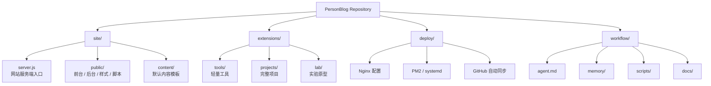
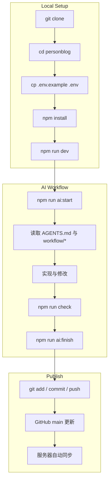

# PersonBlog

<div align="center">

### A personal site hub for identity, writing, experiments, tools, and future projects

[中文](./README.zh-CN.md) | [English](./README.en.md)

</div>

---

## Quick Answer

### 本地开发要不要手动执行 `deploy/` 里的文件？

不用。

`deploy/` 只给服务器部署和自动同步使用。  
如果只是把仓库拉到本地运行网站，通常只需要：

```bash
git clone <your-repo-url>
cd personblog
cp .env.example .env
npm install
npm run dev
```

默认访问：

- 前台：`http://localhost:3000`
- 后台：`http://localhost:3000/admin-login`

### 什么时候才需要看 `deploy/`？

只有下面这些场景才需要：

- 把项目部署到服务器
- 配置 Nginx
- 配置 PM2
- 开启服务器自动同步 GitHub

---

## Repository Layout

```text
personblog/
├─ site/         当前主站
├─ extensions/   后续工具 / 项目 / 实验
├─ deploy/       服务器部署与同步
├─ workflow/     AI 协作工作流
└─ storage/      运行时数据（线上生成，不进 Git）
```

---

## Structure Graph



---

## What Each Main Folder Does

### `site/`

当前网站本体都在这里。

- `site/server.js`
  网站服务端入口。负责启动 Express、提供接口、处理后台登录、读取内容、返回页面。
- `site/public/`
  网页层。包括前台页面、后台页面、CSS、前端 JS、静态资源。
- `site/content/`
  默认内容模板。相当于“项目自带的初始站点内容”。

### `extensions/`

以后新增功能的统一入口。

- `extensions/tools/`
  放轻量工具，比如提示词库、文本工具、小页面。
- `extensions/projects/`
  放更完整、独立的项目。
- `extensions/lab/`
  放实验页、原型、临时想法。

### `deploy/`

只给服务器使用，不是本地开发必看目录。

里面放：

- Nginx 配置模板
- 服务器更新脚本
- GitHub 自动同步脚本
- systemd service / timer

### `workflow/`

给 AI 协作开发使用的固定工作流。

里面放：

- `workflow/agent.md`
  AI 要遵守的项目上下文规则。
- `workflow/memory/`
  当前任务、项目记忆、历史工作日志。
- `workflow/scripts/`
  开始任务、输出上下文、结束任务的命令脚本。
- `workflow/docs/`
  AI 工作流、架构说明、路线图。

---

## Local Development

```bash
git clone <your-repo-url>
cd personblog
cp .env.example .env
npm install
npm run dev
```

如果只是本地看效果，到这里就够了。  
**不需要执行 `deploy/` 里的脚本。**

---

## AI Workflow

这套流程不是给普通访客看的，而是给后续接手项目的 AI 工具看的。

### Start

```bash
npm run ai:start -- "任务摘要"
```

### Load Context

```bash
npm run ai:context
```

### Finish

```bash
npm run ai:finish -- "完成摘要"
```

### Read Order

1. `AGENTS.md`
2. `workflow/agent.md`
3. `workflow/memory/current-task.md`
4. `workflow/memory/project-memory.md`
5. `workflow/memory/work-log.md`
6. `workflow/docs/ARCHITECTURE.md`
7. `workflow/docs/ROADMAP.md`

---

## Workflow Graph



---

## Runtime Data

线上运行时数据不会写回仓库，而是写到 `storage/`：

- `storage/site-content.json`
- `storage/messages.json`
- `storage/ai-config.json`
- `storage/ai-config.private.json`

这样做是为了：

- GitHub 保持干净
- 服务器更新代码时不覆盖线上内容
- AI Key 不进入版本库

---

## Deployment

服务器部署说明见：

- [DEPLOY.md](./DEPLOY.md)
- [deploy/](./deploy)

---

## License

[MIT](./LICENSE)
