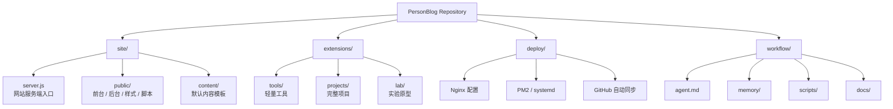
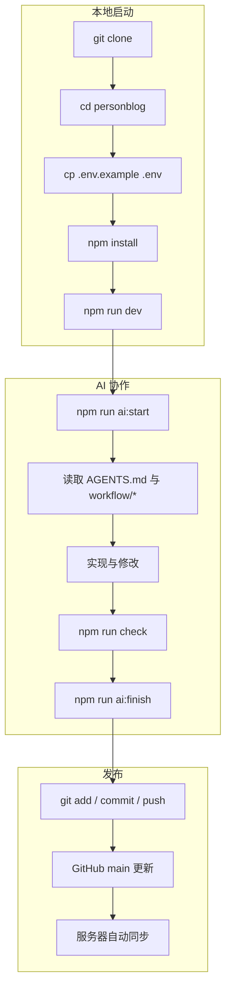

# PersonBlog

<div align="center">

### 一个用于个人主页、博客、工具入口、项目入口与 AI 协作开发的站点仓库

[中文](./README.zh-CN.md) | [English](./README.en.md)

</div>

---

## 快速说明

### 本地开发要不要执行 `deploy/`？

不用。

`deploy/` 是给服务器部署用的。  
如果只是本地运行：

```bash
git clone <your-repo-url>
cd personblog
cp .env.example .env
npm install
npm run dev
```

默认访问：

- 前台：`http://localhost:3000`
- 后台：`http://localhost:3000/admin-login`

### `site/server.js`、`site/public/`、`site/content/` 分别是干什么的？

- `site/server.js`
  网站服务端入口。负责启动网站、处理接口、管理后台登录、读取和保存内容。
- `site/public/`
  网页层。包括首页、后台页面、样式文件、前端脚本。
- `site/content/`
  默认内容模板。新项目启动时的初始数据在这里，线上真正运行的数据写入 `storage/`。

---

## 顶层目录

```text
personblog/
├─ site/         当前主站
├─ extensions/   后续工具 / 项目 / 实验
├─ deploy/       服务器部署与同步
├─ workflow/     AI 协作工作流
└─ storage/      运行时数据（线上生成，不进 Git）
```

## 结构图



---

## AI 工作流

### 开始任务

```bash
npm run ai:start -- "任务摘要"
```

### 输出上下文

```bash
npm run ai:context
```

### 结束任务

```bash
npm run ai:finish -- "完成摘要"
```

### 工作流图



---

## 部署

看：

- [DEPLOY.md](./DEPLOY.md)
- [deploy/](./deploy)

---

## 许可

[MIT](./LICENSE)
