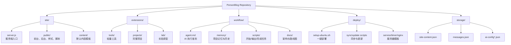
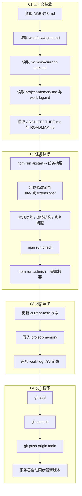

# PersonBlog

<div align="center">

### 一个把个人主页、博客、AI 工作流与未来扩展入口收在同一个仓库里的站点骨架

[默认 README](./README.md) | [English](./README.en.md)

</div>

---

## 项目定位

这个仓库不是单一页面模板，而是一个持续生长的个人站点底座。

它同时承担四件事：

- 个人主页与博客
- 未来工具页、实验页、独立项目的统一入口
- 可编辑内容的轻量后台
- 面向 AI 协作开发的固定工作流

换句话说，它更像一个“个人数字中枢”，而不是一次性做完就不再扩展的静态网页。

---

## 仓库结构

```text
personblog/
├─ site/          主站代码
├─ extensions/    后续扩展入口
├─ workflow/      AI 协作工作流
├─ deploy/        服务器自动化文件
├─ storage/       运行时数据（生产环境生成，不进 Git）
├─ README.md
├─ README.zh-CN.md
├─ README.en.md
├─ AGENTS.md
├─ package.json
└─ ecosystem.config.cjs
```

## 结构图



---

## 目录职责

| 路径 | 作用 |
| --- | --- |
| `site/server.js` | 网站服务端入口。负责启动 Express、处理接口、后台登录、内容读写、AI 对话转发。 |
| `site/public/` | 网页前端层。首页、后台页、样式、前端脚本、404 页面都在这里。 |
| `site/content/` | 默认内容模板。新部署时会作为初始站点内容来源。 |
| `extensions/tools/` | 以后放轻量工具，比如提示词工具、文本处理器、收藏索引。 |
| `extensions/projects/` | 以后放完整项目入口或独立项目页。 |
| `extensions/lab/` | 以后放实验页、草稿页、原型页。 |
| `workflow/` | 面向 AI 协作的固定上下文、历史记忆、脚本与文档。 |
| `deploy/` | 服务器自动化文件夹，用于一键部署、GitHub 自动同步、Nginx/PM2/systemd 配置。 |
| `storage/` | 运行时数据目录。线上后台改动、留言、AI 私密配置都保存在这里，不跟 Git 走。 |

---

## 主站实现方式

主站部分是“轻后端 + 静态前端页面”的结构：

- Node.js + Express 负责服务端与接口
- `site/public/` 直接提供页面与静态资源
- `site/content/` 提供默认内容种子
- `storage/` 保存运行时内容，保证 `git pull` 不覆盖线上数据

这让项目同时具备两种特性：

- 对小白友好：目录不深，容易看懂
- 对后续扩展友好：可以持续往 `extensions/` 增加新模块

---

## AI 工作流

这个仓库内置了一套固定的 AI 协作流程，目的不是“记录聊天”，而是把任务上下文沉淀成文件，让后续任何 AI 都能快速接手。

### 读取顺序

1. `AGENTS.md`
2. `workflow/agent.md`
3. `workflow/memory/current-task.md`
4. `workflow/memory/project-memory.md`
5. `workflow/memory/work-log.md`
6. `workflow/docs/ARCHITECTURE.md`
7. `workflow/docs/ROADMAP.md`

### 常用命令

```bash
npm run ai:start -- "任务摘要"
npm run ai:context
npm run ai:finish -- "完成摘要"
```

### 流程图



---

## 本地启动

```bash
git clone <your-repo-url>
cd personblog
cp .env.example .env
npm install
npm run dev
```

默认访问地址：

- 前台：`http://localhost:3000`
- 后台：`http://localhost:3000/admin-login`

---

## 运行时数据

运行时数据不会写回仓库，而是落到 `storage/`：

- `storage/site-content.json`
- `storage/messages.json`
- `storage/ai-config.json`
- `storage/ai-config.private.json`

这样做的目的有三个：

- 线上内容不会被代码更新覆盖
- GitHub 保持干净
- AI Key 等私密配置不进入仓库

---

## License

[MIT](./LICENSE)
